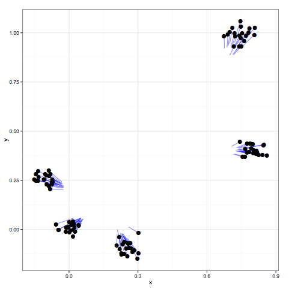

<style>
    .reveal h4 {
        text-align: left;
    }
</style>

## My story with <span style="color: orange">`R` in USA</span> 

> * `R` skill brought me to work in USA in Biostatistics Departments<br /><br /> 
> * <span style="color: orange">Top #1 tool</span> used in academic Biostatsistics<br /><br />
> * <span style="color: orange">Reproducibility & usability awareness</span> - rarely one can see a methodology paper published without corresponding `R` package<br /><br /> 


#  <span style="color: orange">Clustering</span> 

## Cluster analysis -  <span style="color: orange">goals</span>   

<br />

> * We perform clustering when we want to <span style="color: orange">group or segment the data set</span> into subsets so that objects within each subset are more closely related to others than those objects assigned to other subsets. 


## Motivation: <span style="color: orange">cancer subtype discovery</span> 

> * A cancer may present clinically as a homogenous disease, but it typically consists of several distinct <span style="color: orange">subtypes at the molecular level</span><br /><br />

> * One of cancer research goals is to identify such cancer subtypes - groups of patients that share <span style="color: orange">distinct genomic signatures and cancer-differing clinical outcomes</span><br /><br />

> * It is the first step towards developing personalized treatment strategies (example: see MD Anderson Cancer Center (Houston, TX) [Personalized Cancer Therapy webpage](https://pct.mdanderson.org/#/) based on Molecular Profiling)


## Cancer subtype discovery as a <span style="color: orange">biclustering</span> problem 

> * We look for subtypes of cancerous tumors that have similar molecular profiles and the genes that characterize each of the them<br /><br />
> * This subtype discovery problem can be posed as a <span style="color: orange">biclustering problem of gene expression
data</span> matrix, where data is partitioned into a checkerboard-like pattern 


## 

 


## Cancer subtype discovery as a <span style="color: orange">biclustering</span> problem - <span style="color: orange">successess and failures</span>

> * Biclustering breast cancer data has identified sets of genes whose expression levels segregated patients into
five subtypes with distinct survival outcomes (Sørlie et al., 2001)<br /><br />
> * These subtypes have been reproduced in numerous other studies (Sørlie et al., 2003)<br /><br />
> * ... but some other subtypes discoveries were not (i.e. with ovarian cancer (Tothill et al., 2008))


## Cancer subtype discovery as a <span style="color: orange">biclustering</span> problem - <span style="color: orange">challenges</span>

> * The failure to reproduce these other results may reflect an absence of biologically meaningful
groupings<br /><br />
> * ... but another possibility may be related to <span style="color: orange">limitations in the computational
methods currently used</span> to identify biclusters<br /><br />

> * **Goal**: Discover clinically <span style="color: orange">meaningful & reproducible</span> cancer subtypes


# Simple solution: <span style="color: orange">bicluster heatmap</span> with `hclust`

## Simple solution: <span style="color: orange">bicluster heatmap</span> with `hclust`

```{r setup, echo = FALSE, results = "hide", include = FALSE}
# Load all libraries actually here so as to hide packages loading  messages 
library(knitr)
library(s4vd)
library(cvxbiclustr)

opts_knit$set(upload.fun = function(file) imgur_upload(file))
```

```{r, echo = TRUE, results = "hide", fig.height=3.5}
library(s4vd)
data(lung200) # lung cancer data set (Bhattacharjee et al. 2001)

lung200.D.mat <- dist(lung200, method = "euclidean") 
lung200.hclust <- hclust(t(lung200.D.mat), method = "average")

heatmap(lung200, Rowv = as.dendrogram(lung200.hclust), cexRow = 0.3, cexCol = 0.7)
```


## Simple solution: `hclust` - <span style="color: orange">algorithm</span>

1. Begin with $n$ observations and a measure (i.e. Euclidean distance) of all the $n  = n(n − 1)/2$ pairwise dissimilarities. Treat each observation as its own cluster. 

2. For $i=n,n−1,...,2$:

    - Examine all <span style="color: orange">pairwise inter-cluster dissimilarities</span> among the $i$ clusters and identify the pair of clusters that are least dissimilar (that is, most similar). <span style="color: orange">Fuse</span> these two clusters. 
    
    - Compute the new pairwise inter-cluster dissimilarities among the $i-1$ remaining clusters.

## Simple solution: `hclust` - <span style="color: orange">pros and cons</span>

* Pros:

    * Easy to interpret
    * Fast computation 
    
* Cons:

    * <span style="color: orange">Lack of global objective function</span>
    * <span style="color: orange">Instability</span> (subject to perturbations in data, distance choice, linkage type choice)
    * How to choose number of biclusters?

## `hclust` - distance choice effect

```{r, echo = T, fig.width=3, fig.height=4.5, eval = F}
# Function to plot heatmap with hclust dendrogram (method = "average") 
plot.lung200.heatmap.1 <- function(row.dist, col.dist, plt.title){
  heatmap(lung200, main = plt.title,
          cexRow = 0.3, cexCol = 0.7, labRow = FALSE, labCol = FALSE, 
          Rowv = as.dendrogram(hclust(row.dist, method = "average")), 
          Colv = as.dendrogram(hclust(col.dist, method = "average")))
}


D.mat.row <- dist(lung200, method = "euclidean")
D.mat.col <- dist(t(lung200), method = "euclidean")
plot.lung200.heatmap.1(D.mat.row, D.mat.col, "Euclidean dist")

D.mat.row <- dist(lung200, method = "maximum")
D.mat.col <- dist(t(lung200), method = "maximum")
plot.lung200.heatmap.1(D.mat.row, D.mat.col, "Maximum dist")

D.mat.row <-  as.dist(1 - cor(t(lung200)))
D.mat.col <- as.dist(1 - cor(lung200))
plot.lung200.heatmap.1(D.mat.row, D.mat.col, "Correlation dist")
```

## 


## `hclust` - linkage function choice effect

```{r, echo = T, fig.width=3, fig.height=4.5, eval = F}
# Function to plot heatmap with hclust dendrogram (distance method = "euclidean") 
plot.lung200.heatmap.2 <- function(hclust.method, plt.title){
  D.mat.row <- dist(lung200, method = "euclidean")
  D.mat.col <- dist(t(lung200), method = "euclidean")
  heatmap(lung200, main = plt.title,
          cexRow = 0.3, cexCol = 0.7, labRow = FALSE, labCol = FALSE, 
          Rowv = as.dendrogram(hclust(D.mat.row, method = hclust.method)), 
          Colv = as.dendrogram(hclust(D.mat.col, method = hclust.method)))
}

plot.lung200.heatmap.2("average", "'average' linkage")
plot.lung200.heatmap.2("single", "'single' linkage")
plot.lung200.heatmap.2("complete", "'complete' linkage")
plot.lung200.heatmap.2("centroid", "'centroid' linkage")
```

## 


## `hclust` - perturbations in data effect 

```{r, echo = T, fig.width=3, fig.height=4.5, eval = F}
plot.lung200.heatmap.3 <- function(gaussian.sd, plt.title){
  n <- dim(lung200)[1] * dim(lung200)[2]
  gaussian.err <-  matrix(rnorm(n, sd = gaussian.sd), 
                          nrow = dim(lung200)[1], ncol = dim(lung200)[2])
  lung200.pert <- lung200 + gaussian.err
  D.mat.row <- dist(lung200.pert, method = "euclidean")
  D.mat.col <- dist(t(lung200.pert), method = "euclidean")
  heatmap(lung200.pert, main = plt.title,
          cexRow = 0.3, cexCol = 0.7, labRow = FALSE, labCol = FALSE, 
          Rowv = as.dendrogram(hclust(D.mat.row, method = "average")), 
          Colv = as.dendrogram(hclust(D.mat.col, method = "average")))
}

R2 <- 0.8
err.sd <- sqrt(var(as.vector(lung200)) * (1 - R2) / R2) 
set.seed(1)
plot.lung200.heatmap.3(0, "No Gaussian pert.")
plot.lung200.heatmap.3(err.sd, "Gaussian pert. 1.")
plot.lung200.heatmap.3(err.sd, "Gaussian pert. 2.")
plot.lung200.heatmap.3(err.sd, "Gaussian pert. 3.")
```

## 


## Question:

### Can we formulate a convex method for clustering that will yield a <span style="color: orange">unique & global solution</span>?


# <span style="color: orange">Convex</span> Biclustering

## <span style="color: orange">Convex</span> Clustering - idea 

#### Goal:

- <span style="color: orange">Simple and interpretable</span> like cluster dendrogram<br /><br />
- Good algorithmic behavior: 
    - <span style="color: orange">Global minimizer</span>
    - <span style="color: orange">Stability with respect to data</span> and other inputs<br /><br />
- Good, data-driven way to select cluster number and extent<br /><br />

## <span style="color: orange">Convex</span> Clustering - idea 

#### Solution:

- Solve combinatorially hard problem with its <span style="color: orange">convex surrogate</span>:<br /><br /> 
    - All local minima are global minima<br /><br />
    - Algorithms converge to global minimizer regardless of initialization


## <span style="color: orange">Convex</span> Clustering - formula


* $\mathbf{u}_i$ is a _centroid_ to each data point $\mathbf{x}_i$<br /><br />
* $\gamma \sum_{i<j}w_{ij}|| \textbf{u}_i-  \textbf{u}_j||_1$  penalty shrinks centroids together <br /><br />
* $\gamma$ controls BOTH cluster assignments & number of clusters:
    * $\gamma=0$ - each observation is its own cluster
    * $\gamma$ larger - column means begin to merge together into clusters
    * $\gamma$ very large - all observations fused into one cluster<br /><br />
* $w_{ij}$ - weights - sparse, proportional to distance between observations; pre-assigned 


## <span style="color: orange">Convex</span> Clustering - solution path 


$\gamma_0 = 0$ used, gives as many clusters as points 

##  



$\gamma_{k_1}$ used, such as: $\gamma_{k_1} > \gamma_0$ 

##


$\gamma_{k_2}$ used, such as: $\gamma_{k_2} > \gamma_{k_1}$; 5 clusters

##


$\gamma_{k_3}$ used, such as: $\gamma_{k_3} > \gamma_{k_2}$; 3 clusters

##


$\gamma_{k_4}$ used, such as: $\gamma_{k_4} > \gamma_{k_3}$; 3 clusters

##


$\gamma_{k_5}$ used, such as: $\gamma_{k_5} > \gamma_{k_4}$; 1 cluster


## <span style="color: orange">Convex</span> Biclustering - formula

* Similar idea applies when we cluster both columns and rows (biclustering): 


* $i$-th and $j$-th columns belong to same _column cluster_ if $$\mathbf{U}_{\cdot i} − \mathbf{U}_{\cdot j} = 0$$
* $k$-th and $l$-th rows belong to same _row cluster_ if $$\mathbf{U}_{k \cdot} − \mathbf{U}_{l \cdot} = 0$$


# <span style="color: orange">Convex</span> Biclustering - application on `lung200` data

##  `lung200` data set 

* The data consists of the <span style="color: orange">expression levels of 200 genes across 56 individuals</span>, a subset of the data studied in Lee et al. (2010).

* Subjects belong to one of <span style="color: orange">four lung cancer subgroups</span>: Normal, Carcinoid, Colon, or Small Cell.

```{r}
lung200[1:5, 1:5]  # lung cancer data set 
```

## 

```{r, results = "hide"}
# Normalize data 
X <- lung200
X <- X - mean(X)
X <- X/norm(X,'f') 


# Create annotation for heatmap
types <- colnames(lung200)
ty <- as.numeric(factor(types))
cols <- rainbow(4)
YlGnBu5 <- c('#ffffd9','#c7e9b4','#41b6c4','#225ea8','#081d58')
hmcols <- colorRampPalette(YlGnBu5)(256)


# Construct weights and edge-incidence matrices
library(cvxbiclustr)
wts <- gkn_weights(X) # combines Gaussian kernel weights with k-nearest neighbor weights
w_row <- wts$w_row  # Vector of weights for row graph
w_col <- wts$w_col  # Vector of weights for column graph
E_row <- wts$E_row  # Edge-incidence matrix for row graph
E_col <- wts$E_col  # Edge-incidence matrix for column graph
```


## 

```{r, results = "hide"}
# Initialize path parameters and structures
(gammaSeq <- 10^seq(0, 3, length.out = 5))

# Generate solution path,
# perform an MM algorithm wrapper to do parameter selection
#
# (MM algorithm is an iterative optimization method which exploits the convexity 
# of a function in order to find their maxima or minima)
solution <- cobra_validate(X, E_row, E_col, w_row, w_col, gammaSeq)
```
```{r}
# Solutions validation error
round(solution$validation_error, 2)
```


## 

```{r, fig.width=6}
idx <- 1
heatmap(solution$U[[idx]], col = hmcols, labRow = NA, labCol = NA, ColSideCol = cols[ty],
        main = paste0("gamma = ",round(gammaSeq[idx], 2)))
```

## 

```{r, fig.width=6}
idx <- 2
heatmap(solution$U[[idx]], col = hmcols, labRow = NA, labCol = NA, ColSideCol = cols[ty],
        main = paste0("gamma = ",round(gammaSeq[idx], 2)))
```


## 

```{r, fig.width=6}
idx <- 3
heatmap(solution$U[[idx]], col = hmcols, labRow = NA, labCol = NA, ColSideCol = cols[ty],
        main = paste0("gamma = ",round(gammaSeq[idx], 2)))
```


## 

```{r, fig.width=6}
idx <- 4
heatmap(solution$U[[idx]], col = hmcols, labRow = NA, labCol = NA, ColSideCol = cols[ty],
        main = paste0("gamma = ",round(gammaSeq[idx], 2)))
```


## 

```{r, fig.width=6}
idx <- 5
heatmap(solution$U[[idx]], col = hmcols, labRow = NA, labCol = NA, ColSideCol = cols[ty],
        main = paste0("gamma = ",round(gammaSeq[idx], 2)))
```


## <span style="color: orange">Convex</span> Biclustering - summary 

- Key property: <span style="color: orange">$\mathbf{U}^*$, the global solution</span> (rows and columns clusters selection), <span style="color: orange">exists, is unique, and depends continuously on shrinkage parameter, weights and data</span> 
$(\gamma,\mathbf{W},\mathbf{\widetilde{W}},\mathbf{X} )$ => implication: <span style="color: orange">**STABILITY**</span> to perturbations in data<br /><br />
- Yields simple & interpretable solutions like cluster heatmap<br /><br />
- Well-behaved:
    - Unique, global minimizer
    -  Stability wrt initialization, parameters, and data<br /><br />
- Fast algorithm<br /><br />
- One tuning parameter $\gamma$ that controls number and extent of biclusters; data-dependent way of selecting $\gamma$ 

## Acknowledgements

* Presentation topic was inspired by **Module 5: Unsupervised Methods for Statistical Machine Learning** of [Summer Institute in Statistics for Big Data](https://www.biostat.washington.edu/suminst/sisbid) I attended at University of Washington in Seattle, WA in 2016.


## Bibliography 

1. Allen, G. I. (2015), Convex Biclustering Techniques for Cancer Subtype Discovery. Slides ([link](http://www.stat.rice.edu/~gallen/cobra_talk_ibright.pdf))
2. Chi, E. C., Allen, G. I., Baraniuk, R. G. (2015), Convex Bilustering
3. Sørlie, T., Perou, C. M., Tibshirani, R. et al. (2001), Gene expression patterns of breast carcinomas distinguish tumor subclasses with clinical implications. Proceedings of the National Academy of
Sciences 98 10869-10874.
4. Sørlie, T., Tibshirani, R., Parker, J. et al. (2003). Repeated observation of breast tumor subtypes
in independent gene expression data sets. Proceedings of the National Academy of Sciences 100 8418-8423.
5. Tothill, R. W., Tinker, A. V., George, J. et al. (2008). Novel molecular subtypes of serous and
endometrioid ovarian cancer linked to clinical outcome. Clinical Cancer Research 14 5198-5208.

## Bibliography (cont.)

6. Lee, M., Shen, H., Huang, J. Z. and Marron, J. S. (2010). Biclustering via Sparse Singular Value
Decomposition. Biometrics 66 1087-1095.
7. James, G., Witten, D., Hastie, T., Tibshirani, R. (2013). An Introduction to Statistical Learning with Applications in R, Springer Science+Business Media, New York.


